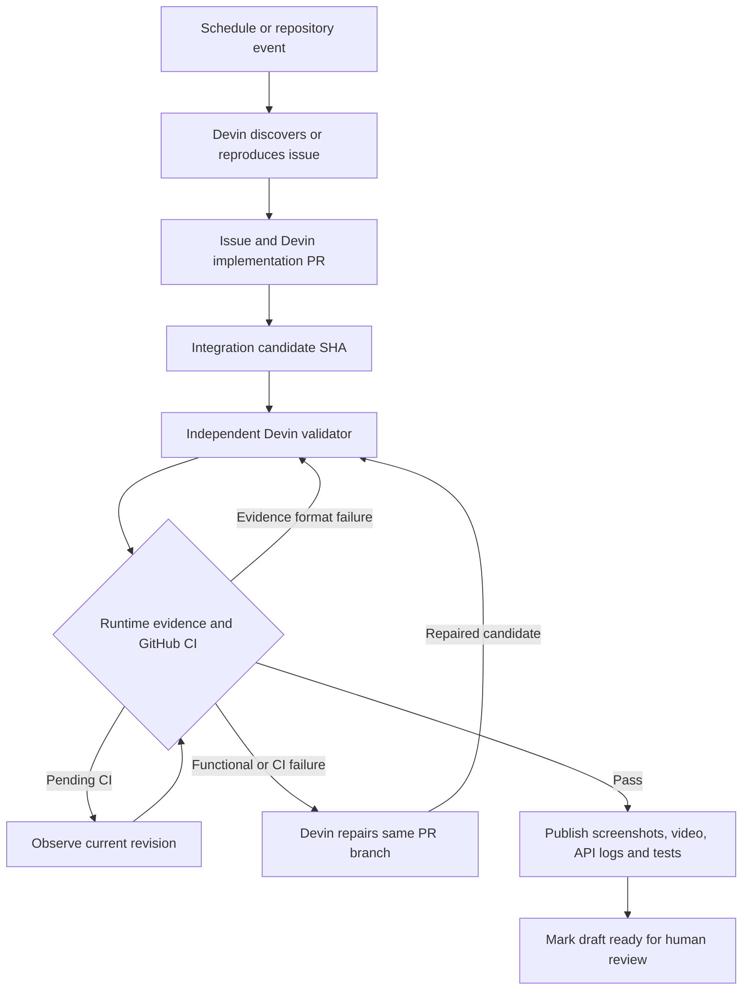

# Autonomous engineering and delivery

Devin is the execution primitive: discovery, diagnosis, code edits, regression tests and real Superset browser/API verification happen in Devin sessions. The application handles event intake, policy, durable orchestration, integration branches, evidence gates and report delivery. Codex changes to this application are distinct from Devin's changes to the Superset fork.

Recovery is bounded. The original PR, branch and current SHA are checked before paid dispatch, before acceptance and before publishing. A repair session cannot validate its own changes. Metadata-only failures, such as PR-title lint, may be corrected without a code commit; the worker requires explicit Devin confirmation and freshly successful CI, then still requests a new independent validator. Failed gate state, recovery intent and reports commit together. Provider uncertainty holds the operation for reconciliation; it does not cause an unbounded duplicate session or comment. No code path automatically merges a PR.

## Earlier PR #4: what actually happened

The original MySQL fix was authored by Devin. An independent Devin session built the integration candidate and collected real Superset evidence. The application delivered comments using Nasdin's GitHub token, so GitHub shows Nasdin as their author. Publication receipts match the comment URLs.

However, the legacy implementation handoff and later v1-to-v2 validation handoff required operator recovery. Those historical steps are documented in `VERIFICATION.md` and `CONTINUE.md`; they were not a fully autonomous closed loop. On 21 September, a fresh audit also found a failed lint check alongside an older review-ready evidence report. Runtime evidence alone had not checked the full CI state. The new loop treats that as a failure requiring Devin repair and new independent evidence.

The old reports and provider artifacts remain historical records. A new demonstration is complete only when the same automated chain has fresh current-SHA evidence, successful CI, confirmed publication, and a PR ready for human review. Neither local tests of the orchestrator nor screenshots from an earlier SHA fulfill this requirement.

## Example selected for the autonomous chain

Devin's scheduled discovery found a real defect in `get_columns_description`: it dispatched the SQL probe twice. It created [issue #3](https://github.com/Nasdin/superset/issues/3); Devin's implementation is [PR #5](https://github.com/Nasdin/superset/pull/5), assembled in [integration PR #7](https://github.com/Nasdin/superset/pull/7). Their current live gate and provider sessions are authoritative. This document does not claim the pending validation has passed.

[PR #4](https://github.com/Nasdin/superset/pull/4) is the recovery example: a tracked integration PR whose failing GitHub check must be repaired by Devin and revalidated automatically.
