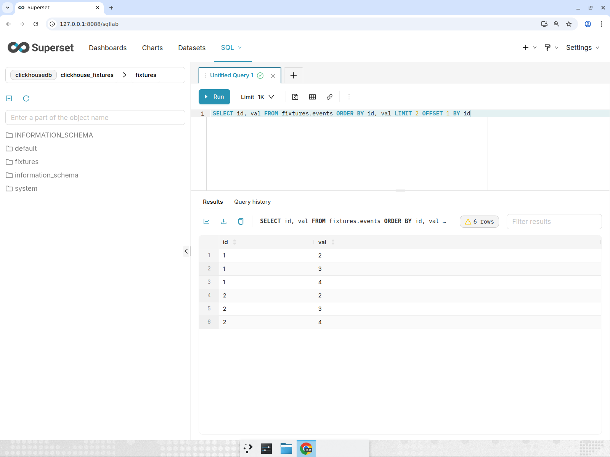
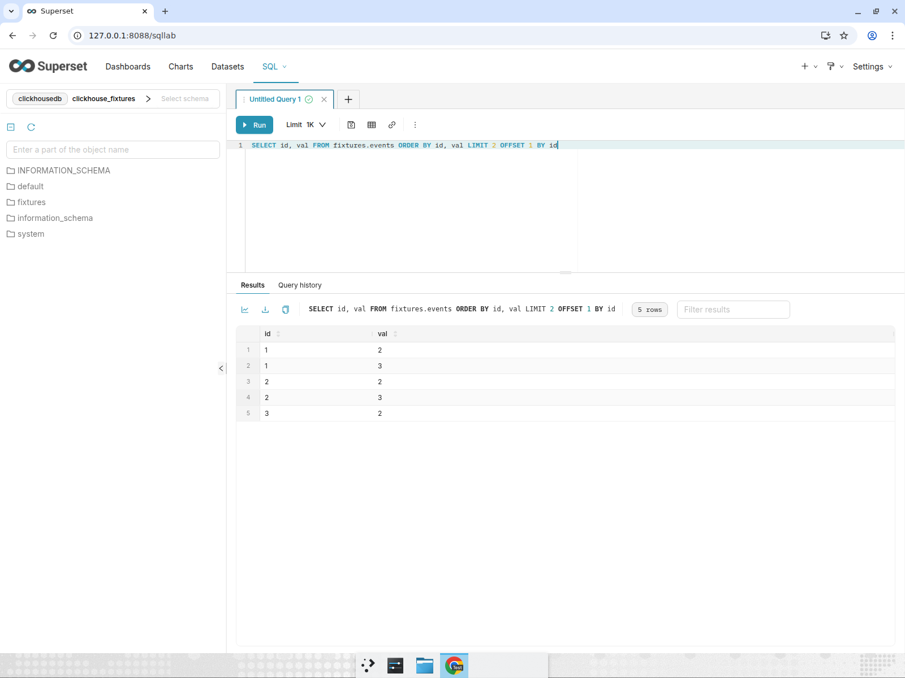

# Human change → failed validation → Devin repair

This is an explicitly requested resilience demonstration, not a claim that the initial defective patch was an organically discovered contribution. Codex acts as Nasdin's human operator for the initial patch; Devin owns the validation and subsequent repairs. No merge or AWS deployment is authorized.

## Behavior and controls

An open PR into the configured fork/target branch opts in with `cognition:validate`. The ordinary GitHub polling or signed-webhook path records its current SHA and starts an independent Devin validator. `VALIDATION_CAPTURE_FAILURE_EVIDENCE=true` runs runtime validation even when GitHub CI is red. Default deployments keep the cheaper CI preflight unless this option is enabled.

The validator checks out the exact candidate, starts Superset and its dependencies, exercises the browser and HTTP API, records real screenshots/video, compares results with the database and runs scoped regression/coverage checks. Failure cannot become readiness because an agent labels its summary passed. Reported failed-test counts override contradictory passing flags.

With failure capture enabled, the failed gate and its report-delivery key are committed with the repair intent. Repair waits until that exact report has a confirmed GitHub receipt. An acknowledged-but-unconfirmed or uncertain publication does not unlock repair. Devin then pushes the actual correction to the same PR branch, adds regression coverage, and returns a new SHA for fresh independent validation. Old evidence remains historical. Current passing CI is still required for review readiness.

Cancelled CI is pending, not passing and not sufficient to trigger a code repair. GitHub's `filter=latest` applies per check suite, so overlapping same-SHA suites can contain both a cancelled job and its replacement. The application confirms workflow identity, event, branch, SHA and run ordering before excluding superseded checks. Checks in unrelated workflows are retained even when their names match.

## Seed and frozen contract

The baseline is `c37118edd0146019ab0ae4ae1a97a597cb56c88e`. The intentionally incomplete human seed is `04bff00adce72e92a948a0b195510f11df85f54b`: a small ClickHouse `LIMIT BY` fix plus a happy-path regression test. It checks only the SQLGlot LIMIT node and therefore misses BY expressions stored on the OFFSET node. Related real defect: [issue #8](https://github.com/Nasdin/superset/issues/8).

The acceptance fixture has `(id, val)` rows with id 1 values 1–5, id 2 values 1–4 and id 3 values 1–2. Above an overall row cap of 11, `LIMIT 2 BY id` returns six rows, while both `LIMIT 2 OFFSET 1 BY id` and `LIMIT 1, 2 BY id` return five: `(1,2), (1,3), (2,2), (2,3), (3,2)`. Browser/API results must agree with direct ClickHouse results. Multiple grouping expressions and ordinary global LIMIT behavior must also be considered.

A narrow local probe executed the actual modified limit methods with pinned SQLGlot 28.10.0 and demonstrated the offset bug. It is not a full Superset runtime test. Changed-file pre-commit checks passed with Ruff 0.9.7, including Mypy and Pylint. An earlier repository-wide pre-commit attempt stalled in concurrent Git attribute checks and was stopped; a repository-wide pass is not claimed.

## Live runs, 21 September 2026

- [PR #11](https://github.com/Nasdin/superset/pull/11) was the first trial into `cognition-human-review-20260921`. A cancelled label check incorrectly triggered early remediation. That event and [its report](https://github.com/Nasdin/superset/pull/11#issuecomment-5758810267) remain in the history. [Devin `6550b602669d4ee9a555a2c8fdcd30fd`](https://app.devin.ai/sessions/6550b602669d4ee9a555a2c8fdcd30fd) pushed `17fce721fbe20a6c3efbb8935dae75450fcc2d97` to the same PR branch and reported 561 passing tests plus new edge-case coverage. This trial did not capture initial failing browser evidence and is not presented as the complete requested sequence.
- [PR #12](https://github.com/Nasdin/superset/pull/12) replays the same incomplete human seed on `cognition/human-validation-first-limit-by`, targeting isolated `cognition-human-evidence-20260921`. Its separate local Postgres ledger enables failure capture and permits three sessions at 20 ACU each, with one repair attempt. [Independent validator `75ea2f5671324b0ead74333816031f19`](https://app.devin.ai/sessions/75ea2f5671324b0ead74333816031f19), job `20fa0027-1880-4f42-a083-da4a01b5dbc6`, published [the failed-runtime report](https://github.com/Nasdin/superset/pull/12#issuecomment-5759200865) before repair began. Although 496 unit tests passed, SQL Lab, API and direct ClickHouse comparison exposed the missed offset case: six rows instead of the expected five. The report includes real screenshots, video, API logs and coverage. [Devin repair `32affbeace1f4ab29e390738427c3916`](https://app.devin.ai/sessions/32affbeace1f4ab29e390738427c3916) pushed `a118efc7dace13270f920607944aab8173b08b79` to the same branch. [Fresh independent validator `c9851e6e5032476c97c6c82c8a9e4232`](https://app.devin.ai/sessions/c9851e6e5032476c97c6c82c8a9e4232) returned passing runtime evidence with 557 passed tests, zero failures, five screenshots, video, API transcripts and scoped coverage. [The application report](https://github.com/Nasdin/superset/pull/12#issuecomment-5759479894) is **awaiting CI**, so merge readiness remains pending.

The initial PR #12 runtime used the exact Python checkout with prebuilt 6.1.0 frontend assets, SQLite metadata and a ClickHouse 26.10 binary after a Docker Hub rate limit. It does not establish a complete frontend build of the candidate. A separate Create chart path reported “Missing dataset”; the saved virtual dataset/dashboard route worked.

The repair exposed a handoff bug: legitimate same-branch commits were compared to the pre-repair SHA. The old repair record became stale; normal PR polling still launched the fresh validator. Recovery now permits a remediation's authorized branch to advance while preserving strict exact-SHA validation and provider-owned final commit confirmation. Historical records were not rewritten.

Both runs use normal intake, engine, handoff, remediation, freshness and publication services. The private local wrappers only isolate the target branch, database and allowed PR; they do not insert jobs or rewrite provider results. Schedules, repository-wide issue intake and Slack delivery are disabled. Media uses the existing evidence-only local tunnel, so those URLs depend on the local server remaining alive. Credentials and execution databases are ignored by Git.

## Application verification

513 backend tests passed, 31 environment-dependent tests skipped; all 26 dedicated Postgres tests passed separately. Ruff check and format passed. Tests cover cancellation and replacement-workflow identity, contradictory regression results, full-runtime validation despite red CI, and blocking repair until the exact failed report has a confirmed receipt. These are application tests; they do not substitute for the live Devin acceptance above.

## Preserved before-and-after evidence

These are actual artifacts from the two independent Devin sessions. All 30 original artifact URLs returned HTTP 200 when archived; committed copies below do not depend on the temporary tunnel. The repaired checkpoint is awaiting CI, not an accepted release.

| Failed human seed | Devin repair, independently checked |
| --- | --- |
|  |  |
| [Browser recording](evidence/human-pr12-failed-04bff00/browser_journey_04bff00.mp4) | [Browser recording](evidence/human-pr12-repaired-a118efc7/sqllab-limit-by-browser-journey.mp4) |
| [API transcript](evidence/human-pr12-failed-04bff00/api_transcript.txt) | [API transcript](evidence/human-pr12-repaired-a118efc7/api-transcript.txt) |
| [Tests](evidence/human-pr12-failed-04bff00/test_report.txt) | [Tests](evidence/human-pr12-repaired-a118efc7/regression-test-report.txt) |
| [Hashes and provider receipts](evidence/human-pr12-failed-04bff00/readback.json) | [Hashes and provider receipts](evidence/human-pr12-repaired-a118efc7/readback.json) |
