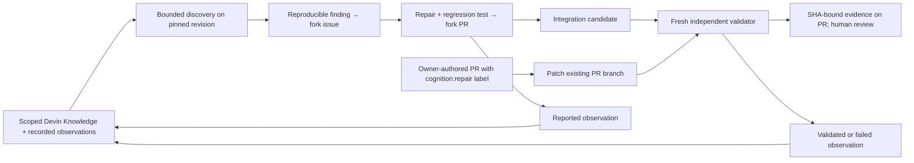

# Learning, memory, and autonomous patches

The **Learning & memory** page connects observations to their source runs, revisions, PRs and evidence. **Workflows** separates requested fixes, autonomous patches and fixes, dependency updates, and integration/validation into visible lanes. These are presentation lanes over one globally bounded queue.

## The loop

Discovery runs at the configured scan interval, at most one reproducible finding per session. The orchestrator creates the issue from the structured result; Devin prepares the fix; an independent session must validate it. Retries reconcile an existing issue and repair child, including when a webhook queued the repair first. An existing finding is not permission to file a duplicate issue.

Existing PR fixes require an open, non-draft PR authored by the configured owner, carrying the repair label, with both head and base in the fork and the configured release branch as target. The head must be a separate branch. Already managed issue repairs and integration candidates cannot start a second patch pipeline. Dependabot retains its separate bot identity check. Both webhook and polling intake are supported. The implementation session updates the original PR, then a fresh validator checks its final SHA.

## What memory means here

- **Reported:** an implementation or discovery session returned an observation. It is not independent proof of a fix.
- **Validated:** the existing evidence gate accepted the source validation at its exact revision. This is historical evidence, not current release approval.
- **Validation failed:** the independent result did not satisfy the gate. A confident summary cannot override this outcome.
- **Stale:** the candidate changed or became ineligible. It is excluded from new explicit memory context.

Immutable local observations store the source job, SHA, session, result, tests and artifacts. Only these project-owned observations are published as organization Knowledge notes, pinned to the configured fork. Nothing imports or edits unrelated organization knowledge. There is no model training or weight update: learning here means retained, reusable evidence and observed outcomes.

Native note creation has a durable intent, receipt and readback. An ambiguous create is reconciled by its content marker and never blindly repeated. The latest observation per run is eligible; superseded and stale notes are disabled at the provider with readback. Disabling `LEARNING_ENABLED` retires this application's existing notes. Before dispatch, obsolete pinned notes must be reconciled; an unresolved retirement blocks a new session rather than silently exposing stale knowledge.

New sessions receive up to ten recent local observations and the corresponding verified `knowledge_ids`. A dispatch snapshot records their exact content and IDs. It records **what this application explicitly supplied**, not everything Devin may retrieve, nor proof that the agent used a note. Older sessions are never retroactively marked as memory-assisted. The journal links to each source run so reviewers can inspect evidence and the agent's explanation.

## Measuring improvement honestly

The page groups completed independent validation outcomes by completion month, showing pass/fail counts, rate and denominator. Unfinished, blocked and stale runs are excluded. This is descriptive history; it does not establish that memories caused improvement. Fewer than two populated months explicitly displays insufficient history. Repository analytics remains the place for sliding-window PR merge-time comparisons.

## Controls and recovery

`LEARNING_ENABLED=true` is the default. A Devin service credential needs `ManageAccountKnowledge`; missing access is visible as a sync error. Existing ACU/session, total-session and timeout limits are unchanged. The scan, repair, patch and dependency lanes all respect the same single-flight and attention holds. No automatic merge or budget increase is added.

Legacy completed scans whose structured result was not saved can be recovered with `scripts/recover_discovery_results.py` inside the configured application runtime. It reads the original provider session, checks the identity and baseline reproduction, restores the local result and reconciles existing lineage. It makes no provider writes and does not invent historical memory context.

## API references

- [Organization Knowledge notes](https://docs.devin.ai/api-reference/v3/notes/organizations-knowledge-notes)
- [Create a Knowledge note](https://docs.devin.ai/api-reference/v3/notes/post-organizations-knowledge-notes)
- [Update a Knowledge note](https://docs.devin.ai/api-reference/v3/notes/put-organizations-knowledge-notes-note-id)
- [Create session with knowledge_ids](https://docs.devin.ai/api-reference/v3/sessions/post-organizations-sessions)
