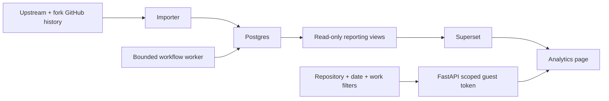

# Superset analyzing Superset

The Analytics page embeds Apache Superset 6.1 using its embedded SDK. The charts query Postgres reporting views of imported public GitHub PR history. React owns the repository and cohort controls; Superset owns chart rendering, queries, tables and downloads. The execution ledger and Superset metadata have separate databases and credentials. This BI instance is independent of the Superset instance used to validate candidate changes.



[Verified local dashboard screenshot](images/superset-analytics-live.png) · [fork screenshot](images/superset-analytics-fork.png) · [verification receipt](analysis/superset-postgres-verification.json).

## Start a clean installation

```sh
cp .env.example .env
python3 scripts/configure_local_postgres.py
docker compose up --build -d
```

Open `http://127.0.0.1:8000` and select Analytics. Superset is available locally at `http://127.0.0.1:8189/bi`; the embedded page does not need an admin login. Provisioning creates six charts and four datasets idempotently. The optional Superset admin username is `cognition-admin`; its generated password remains in ignored `.env`. Credentials are generated once, not reset on container restart. Rotating a database or Superset account password requires updating that account as well as `.env`.

The production Compose runtime uses Postgres 17 for all jobs, audit records, memories, delivery receipts and imported history. SQLite remains only in isolated tests, the explicit legacy demo and a read-only committed public seed. The seed is copied into Postgres once; Superset never queries SQLite. A new installation imports actual public history and starts with an empty workflow ledger. Paid automation is disabled by default.

## Filters and evidence

Six charts show current median, baseline median, percentage change, weekly rolling medians, cohort sample sizes and merged PR details. All use the same server-persisted selection: repository, completed UTC end date, 7–180 day window, previous/custom/six-month baseline, author, label, branch, work category and tracked-work attribution. The baseline uses equal window lengths. Empty cohorts stay empty; percentage change requires covered history and at least five measurements in each window. No chart claims a causal Devin improvement.

The backend issues a five-minute dashboard-specific guest token with a selection hash as a row-level filter. Browser input cannot choose arbitrary dashboards or SQL. The issuer account can grant tokens but cannot administer Superset. Its server-to-server guest-token endpoint requires an explicit JWT header and is the only added CSRF exemption; browser forms retain CSRF protection and secure cookies under public HTTPS. Caddy enforces external HTTPS while internal traffic stays on the private Docker network. Superset's datasource account can read only the four reporting views, with transactions read-only by default. BI containers do not receive GitHub, Devin or Slack credentials. Bootstrap alone receives the application database write credential to create the views.

SQL and Python reference calculations are checked against the same cohorts in real Postgres tests. Browser verification must use guest embedding, because administrator queries bypass the guest restrictions. Run the dedicated live test with:

```sh
cd frontend
E2E_BASE_URL=http://127.0.0.1:8000 SUPERSET_ANALYTICS_E2E=1 npx playwright test tests/superset-analytics.spec.ts
```

## Existing SQLite installation migration

Stop API, worker, analytics and webhook writers. Take consistent SQLite backups using the SQLite backup API, retaining the original files and artifact directory. Start Postgres alone. With the destination `DATABASE_URL` loaded securely, run:

```sh
PYTHONPATH=backend backend/.venv/bin/python scripts/migrate_postgres.py \
  --ledger /path/to/automation-backup.db --history /path/to/analytics-backup.db
docker compose up --build -d
```

The migration refuses a nonempty target, copies every source table in one transaction, compares every copied cell before committing and restores the audit sequence. Do not run it against the now-populated local database. The September 20 migration preserved 7 jobs, 164 audit events, 5 publication records, 3 lessons, 13 memory records, 6 deliveries and 11,706 PR records; [migration receipt](analysis/postgres-migration.json). Counts may grow after restart. Original SQLite files are retained for rollback, but rollback after new Postgres writes requires reconciliation; switching blindly would lose those writes.

## Database tests

Set `TEST_DATABASE_URL` to a dedicated Postgres database ending in `_test`, create a `cognition_reader` role and run the backend suite. These tests destructively recreate tables only inside that explicitly designated test database. CI provides a disposable Postgres 17 service. Never set this variable to the application database.

Superset metadata migrations use its upstream Alembic migrations. Application tables are currently created through SQLAlchemy Core; future schema changes need explicit, versioned migrations before altering a deployed database.
