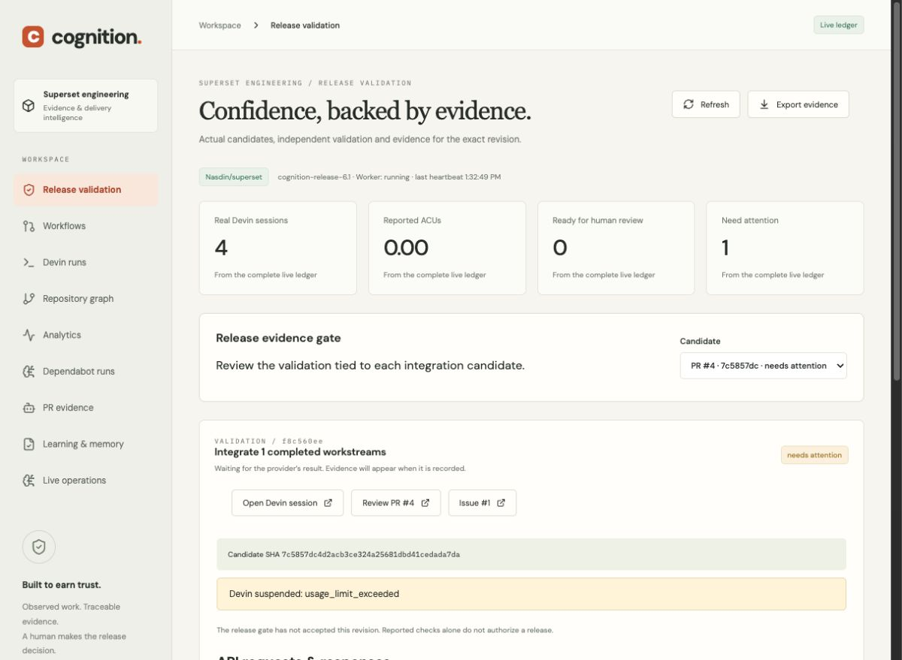
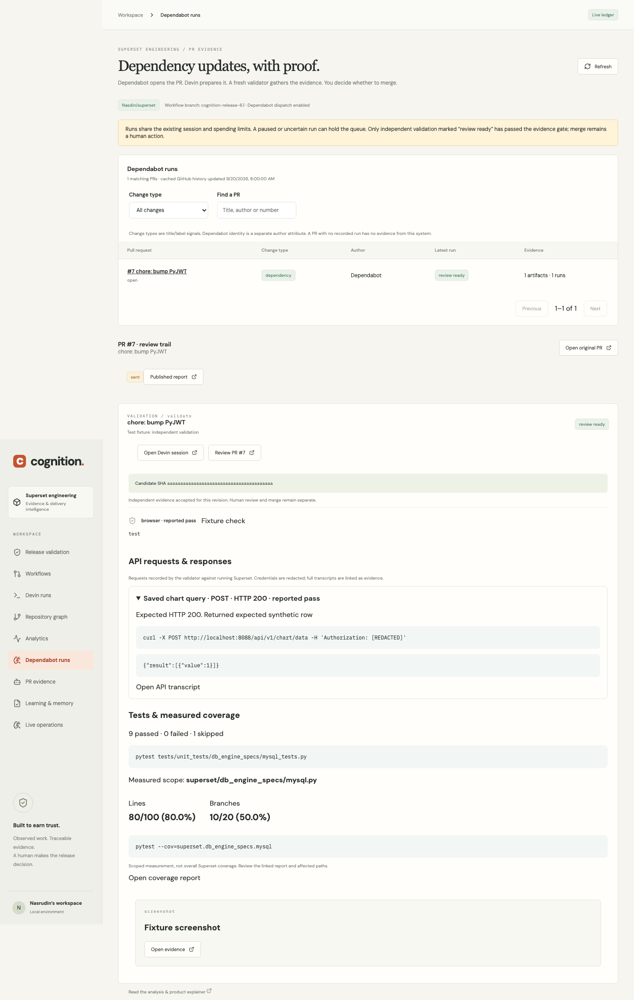

# PR replies with execution evidence

An engineer or Devin can change a PR in `Nasdin/superset`, targeting `cognition-release-6.1`. Add `cognition:validate` to opt an existing fork PR into read-only independent validation. The worker also follows subsequent changes to tracked repair and integration PRs. Dependabot and autonomous patch PRs retain their preparation pipelines; validation intake cannot bypass them.

## What happens

1. A signed `pull_request` event (or the worker's poll) reads the current PR from GitHub. Both branches must belong to the configured fork. Untracked draft PRs, stale events and foreign heads are excluded.
2. Intake coalesces events for the same PR and commit. A fresh Devin session checks out the exact SHA. The shared spending, session and queue limits still apply. An existing paid or uncertain session must be reconciled before another is dispatched.
3. Devin starts real Superset and its required database/cache/worker services, uses the browser to reproduce the affected journey, queries the database and calls the affected functional API with curl. A login or health check alone does not qualify.
4. Devin uploads six distinct evidence files: Superset screenshot, browser video, service logs, test results, API transcript, and measured coverage. The structured evidence includes sanitized requests, observed statuses, response excerpts, behavioral assertions, test counts and line/branch coverage for a named Superset scope.
5. The gate checks SHA, known implementation/validator session independence, provider attachment ownership/type, required checks and execution fields. For external PRs, the ledger must prove this system created the new validator. Updated integration PRs retain known member implementation sessions.
6. The control plane rechecks the PR and component heads immediately before posting the reply. Changed revisions invalidate the pending report. Each post is acknowledged durably, then fetched back to verify the body and target. A readback retry never repeats an acknowledged write.
7. The same recorded evidence appears in Release validation and PR evidence. Human review and merge remain separate.

GitHub authorship follows the configured GitHub credential. Devin performs validation; the control plane publishes its evidence. This installation's delivery test is authored by `Nasdin`, not impersonated as the Devin bot.

## Evidence contract and limits

`evidence_version=2` requires `api_requests`, `test_results` and `coverage` alongside the existing SHA/check/artifact manifest. Coverage percentages are calculated from actual scoped counts, not fabricated, and are not presented as overall Superset coverage. There is no arbitrary Superset coverage threshold. Failed or missing measurements block acceptance. Credentials are redacted from structured evidence and public text; the validator must sanitize raw attachments before upload as well.

The gate validates the manifest and provider attachment metadata. It does **not** independently prove that every artifact's contents support every claim, or that a coverage scope covers all affected code. Engineers must inspect the linked output. A PR can also change after the final read and publication; the report's full SHA is immutable and readiness is subsequently refreshed. This application does not authorize or perform merges.

Sessions already created with the older evidence schema are not retroactively upgraded by deployment. They cannot pass the v2 gate without the new measured evidence. Do not insert fabricated v2 fields to resume an old handoff.

## Verification on 20 September 2026

- 184 backend tests passed, with 84.63% measured control-plane coverage. This is **not Superset coverage**.
- 13 browser/API tests passed; one optional external Superset baseline test skipped. The production frontend and Docker images built successfully.
- Signed HTTP event tests exercise engineer and Devin PR changes, duplicate delivery, fresh validation and confirmed replies. Other tests cover missing evidence, secret redaction, changed heads before publication, provider read outages, duplicate prevention and implementation lineage.
- [Actual GitHub reply](https://github.com/Nasdin/superset/pull/4#issuecomment-5747889051): posted, fetched back, and a repeated publication request verified to leave exactly one comment. [Provider receipt](analysis/pr-validation-reply-readback.json).
- A real PR #4 `pull_request/labeled` event was delivered by GitHub, accepted with HTTP 200, and coalesced to the existing validator. The `cognition:validate` label exists on the fork. [Webhook receipt](analysis/pr-validation-webhook-readback.json).
- That reply is explicitly a **blocked-status delivery test**, not a successful validation. The real validator remains suspended with `usage_limit_exceeded`; its attachment API returned zero files. No new session was created and no spending cap was raised.
- Full acceptance remains outstanding: an authorized live Devin validator must finish the exact candidate journey and publish real Superset API, screenshot/video, test and coverage evidence.

## Dashboard captures

The deployed dashboard shows the real blocked run and absent evidence:

The following browser-test capture uses explicitly named fixtures to verify the UI layout and links. Its figures are test data, **not real Superset validation results**:

