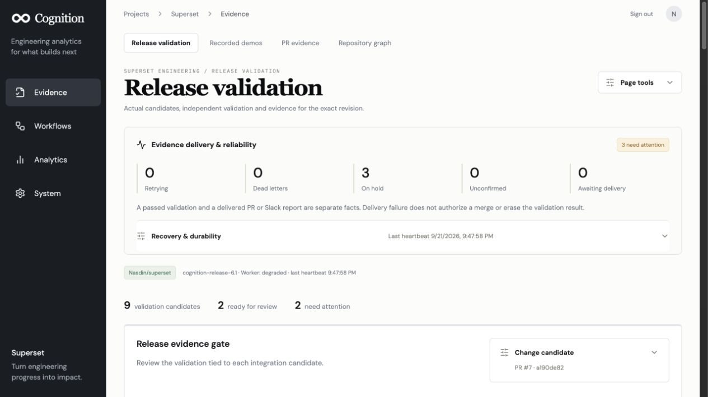
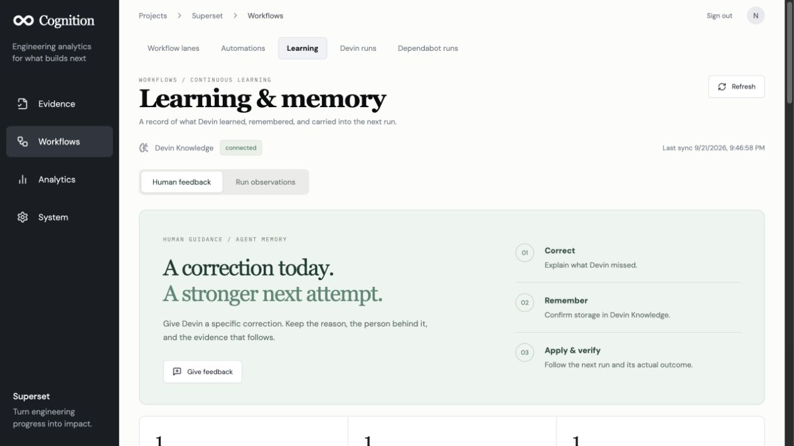
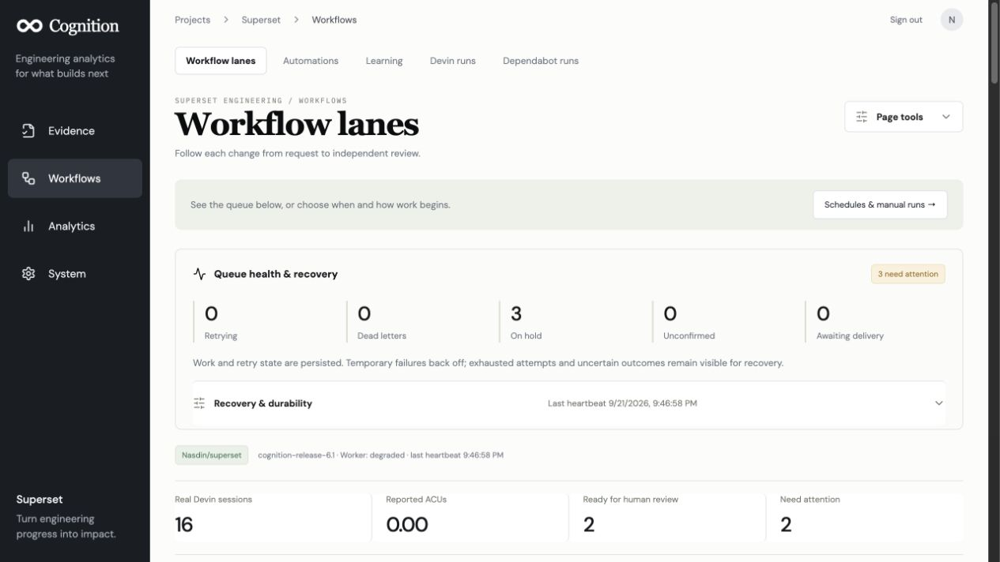
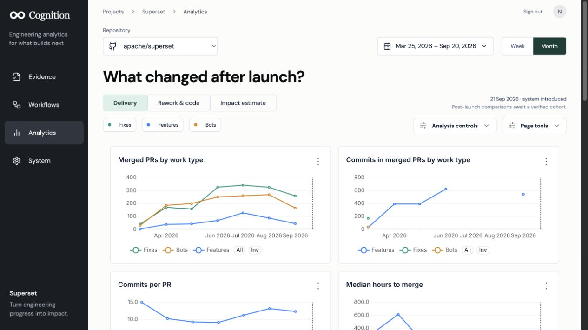

# Cognition: the story, the analysis, and the evidence

Start with the [current product tour and live screenshots](../README.md#product-tour), then inspect the slides and underlying data. The current product captures below reflect the 21 September deployment. The slide deck and linked historical receipts retain their original dates. The charts describe public Superset activity; the workflow diagrams describe our implementation. Slides are explanatory material, **not validation evidence for a release**.

- [Editable nine-slide deck](slides/cognition-story.pptx)
- [Product and analysis explainer](EXPLAINER.md)
- [PR replies, API evidence and coverage](PR_VALIDATION.md)
- [Dependabot workflow, configuration and live verification](DEPENDABOT.md)
- [Machine-readable analysis](analysis/summary.json) · [commit classifications](analysis/commit-classification.csv) · [August PR classifications](analysis/august-pr-classification.csv)
- [Code quality](CODE_QUALITY.md) · [Four-day plan](FOUR_DAY_PLAN.md) · [Verification history](VERIFICATION.md)

## Slide images

### 1. Product thesis

### 2. Repository activity

### 3. PR classification

### 4. Commit analysis

### 5. Follow-up work sample

### 6. Sliding-window comparison

### 7. Dependabot workflow

### 8. Evidence contract

### 9. Current delivery and limits

The [slide source](slides/build.mjs) uses `@oai/artifact-tool` and the supplied Codex presentation runtime. Set `ARTIFACT_TOOL_SKILL_DIR`, `RUNTIME_NODE_MODULES` and `RUNTIME_PYTHON` when rebuilding; run the source where that package can resolve. Charts have editable embedded workbooks and the workflow uses native shapes/connectors. The PPTX was structurally validated and all nine rendered slides inspected; opening in desktop PowerPoint was not part of verification. The analysis script runs offline with the project Python environment. Replacing the dated snapshot requires reviewing the slide captions too.

## Current dashboard

Captured from the hosted application on 21 September 2026. Queue holds remain visible; these captures document the UI, not a passing release report.

[Historical Dependabot intake capture, 20 September](screenshots/dependabot-pr-6.png).

## Learning and autonomous patches

[Learning loop, native Devin Knowledge and workflow lanes](LEARNING.md) explains evidence-backed observations, memory supply snapshots, provider retirement of stale notes and autonomous issue/PR repair boundaries.

## Superset analyzing Superset

The analytics page now embeds actual Superset charts backed by Postgres. [Architecture and migration](POSTGRES_SUPERSET.md), [AWS preparation](AWS_DEPLOYMENT.md), and [local verification receipt](analysis/superset-postgres-verification.json).

