# Cognition: the story, the analysis, and the evidence

Start with the slides, then inspect the underlying data. The charts describe public Superset activity; the workflow diagrams describe our implementation. Slides are explanatory material, **not validation evidence for a release**.

- [Editable nine-slide deck](slides/cognition-story.pptx)
- [Product and analysis explainer](EXPLAINER.md)
- [PR replies, API evidence and coverage](PR_VALIDATION.md)
- [Dependabot workflow, configuration and live verification](DEPENDABOT.md)
- [Machine-readable analysis](analysis/summary.json) · [commit classifications](analysis/commit-classification.csv) · [August PR classifications](analysis/august-pr-classification.csv)
- [Code quality](CODE_QUALITY.md) · [Four-day plan](FOUR_DAY_PLAN.md) · [Verification history](VERIFICATION.md)

## Slide images

### 1. Product thesis

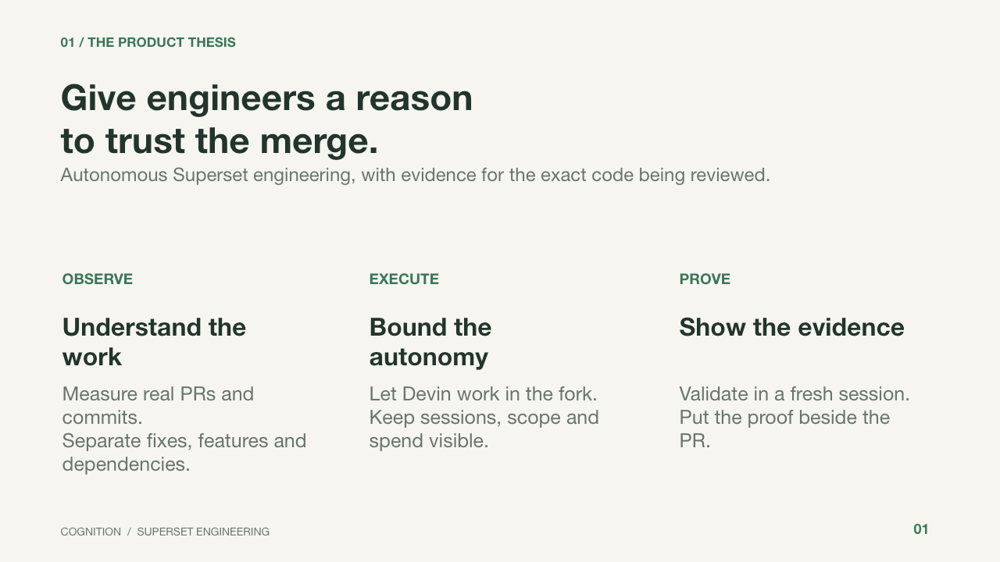

### 2. Repository activity

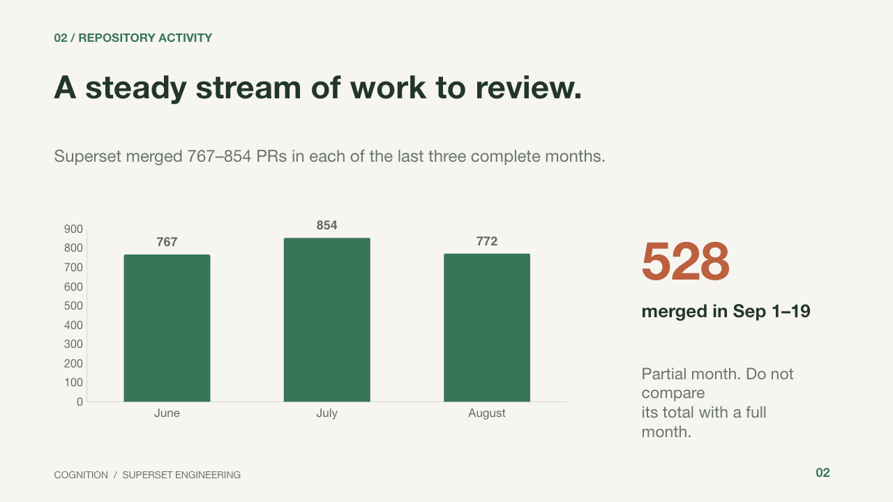

### 3. PR classification

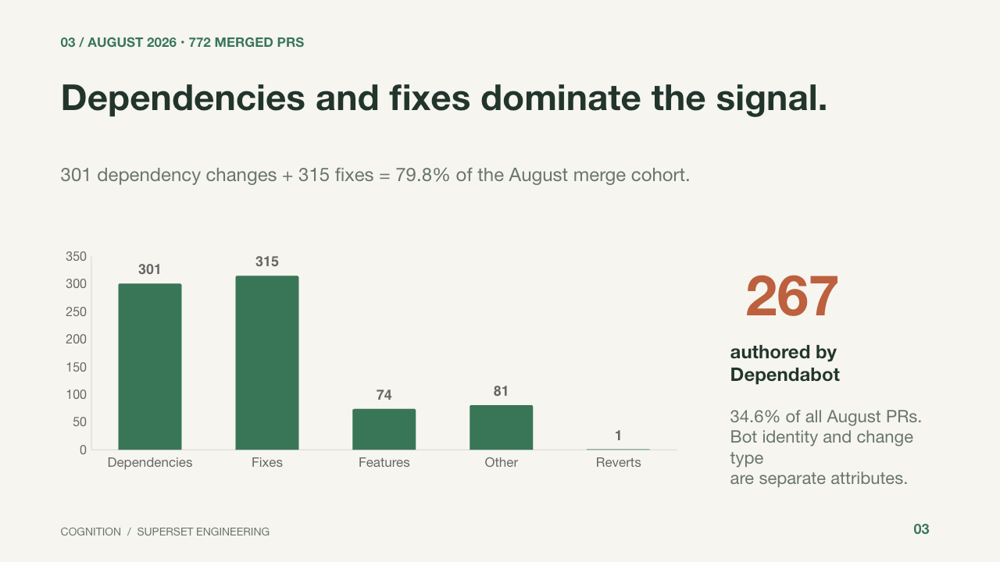

### 4. Commit analysis

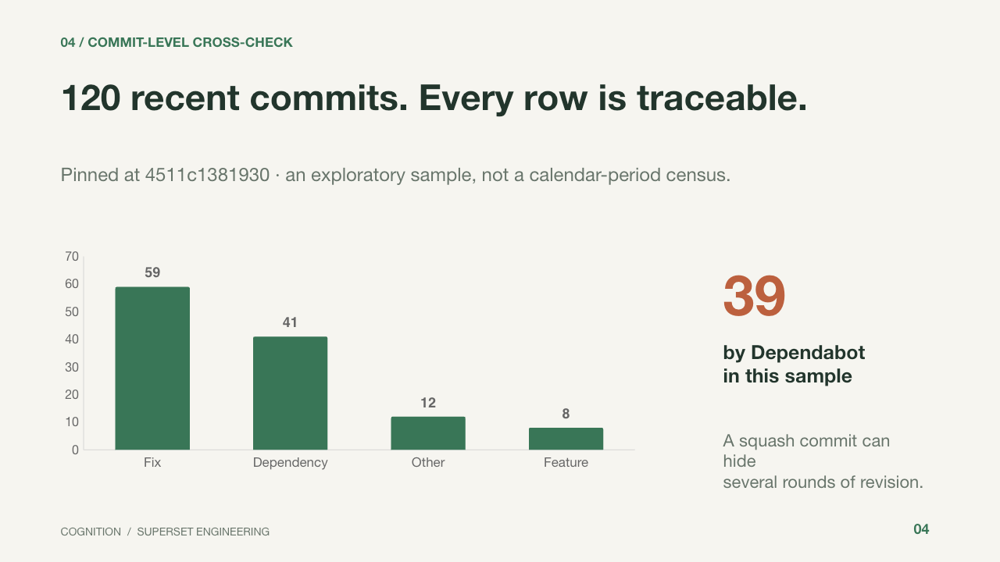

### 5. Follow-up work sample

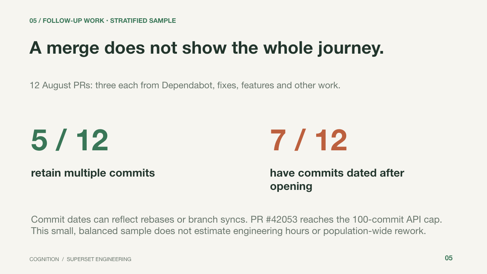

### 6. Sliding-window comparison

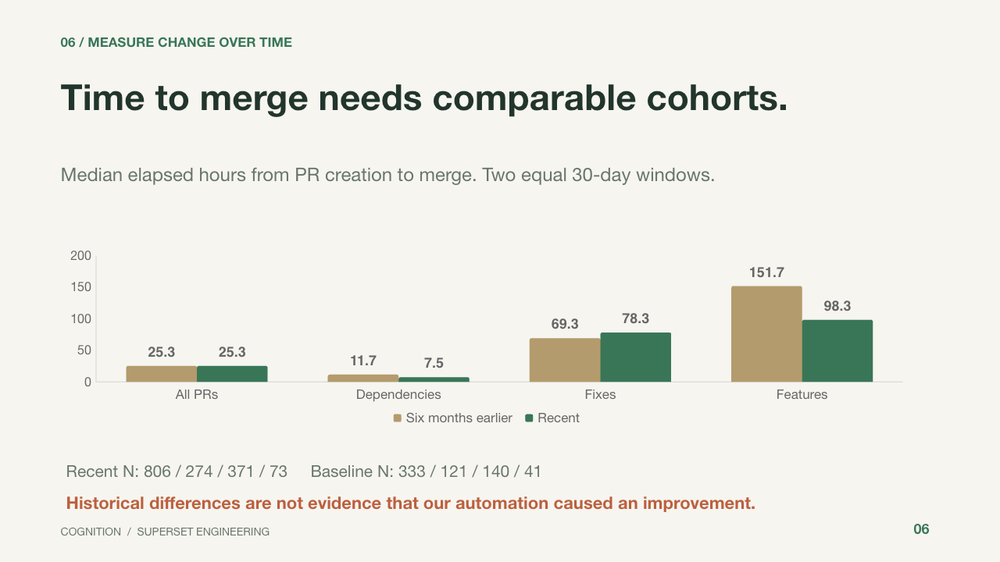

### 7. Dependabot workflow

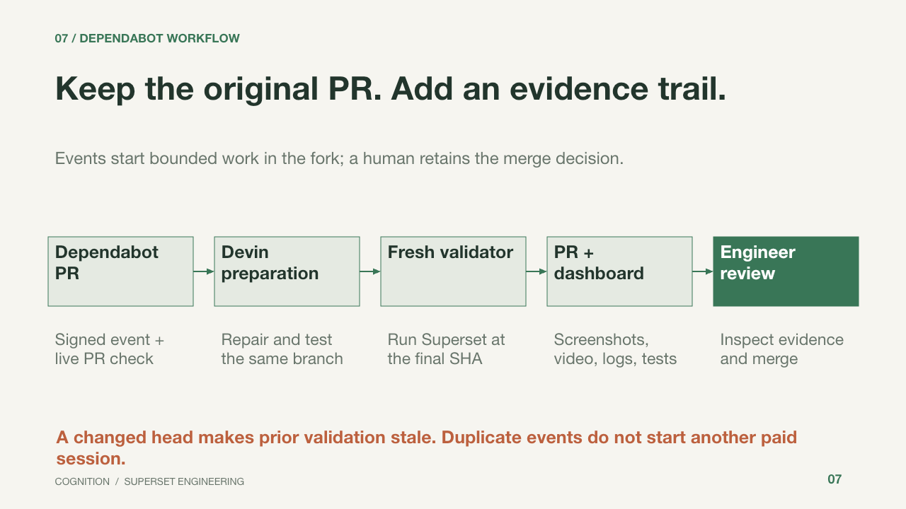

### 8. Evidence contract

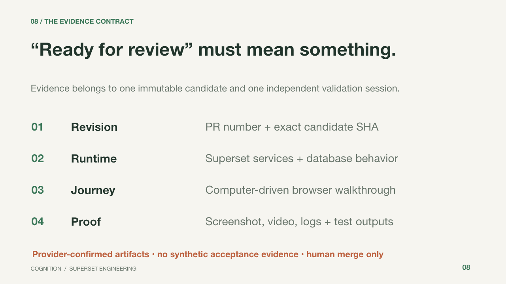

### 9. Current delivery and limits

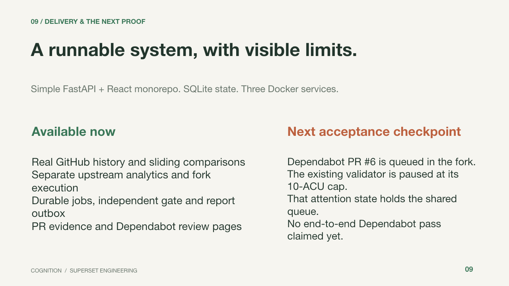

The [slide source](slides/build.mjs) uses `@oai/artifact-tool` and the supplied Codex presentation runtime. Set `ARTIFACT_TOOL_SKILL_DIR`, `RUNTIME_NODE_MODULES` and `RUNTIME_PYTHON` when rebuilding; run the source where that package can resolve. Charts have editable embedded workbooks and the workflow uses native shapes/connectors. The PPTX was structurally validated and all nine rendered slides inspected; opening in desktop PowerPoint was not part of verification. The analysis script runs offline with the project Python environment. Replacing the dated snapshot requires reviewing the slide captions too.

## Actual dashboard

Captured on 20 September 2026 after GitHub created Dependabot PR #6 and its signed event was accepted. The queue hold and absent artifacts are real; this is UI verification, not a passing release report.

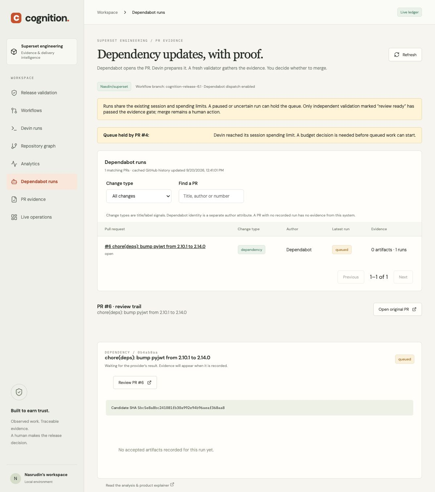

## Learning and autonomous patches

[Learning loop, native Devin Knowledge and workflow lanes](LEARNING.md) explains evidence-backed observations, memory supply snapshots, provider retirement of stale notes and autonomous issue/PR repair boundaries.

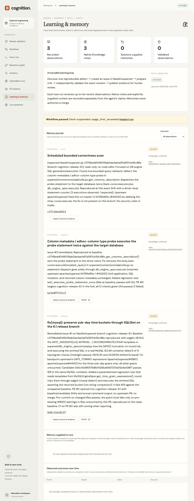

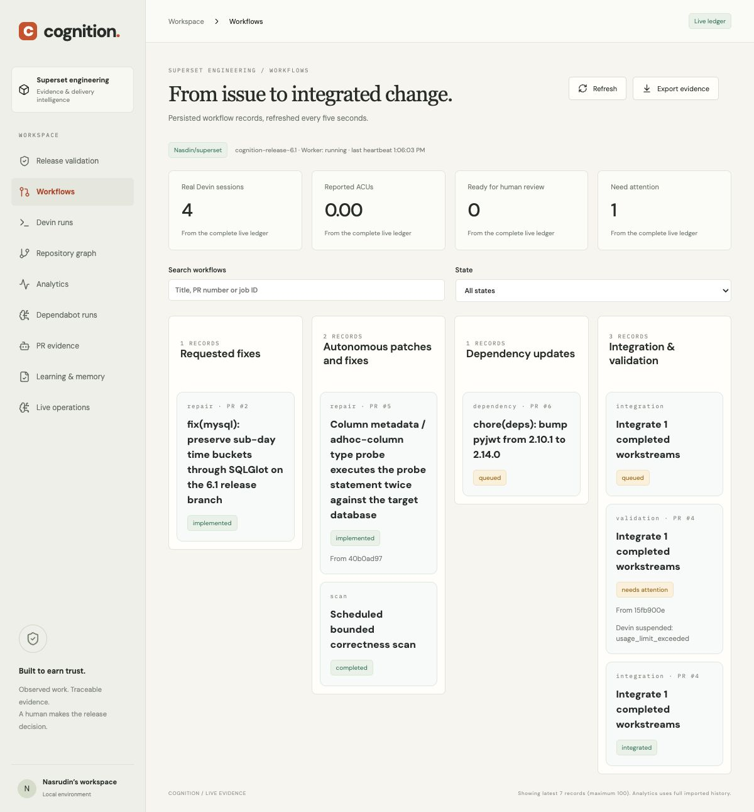

## Superset analyzing Superset

The analytics page now embeds actual Superset charts backed by Postgres. [Architecture and migration](POSTGRES_SUPERSET.md), [AWS preparation](AWS_DEPLOYMENT.md), and [local verification receipt](analysis/superset-postgres-verification.json).

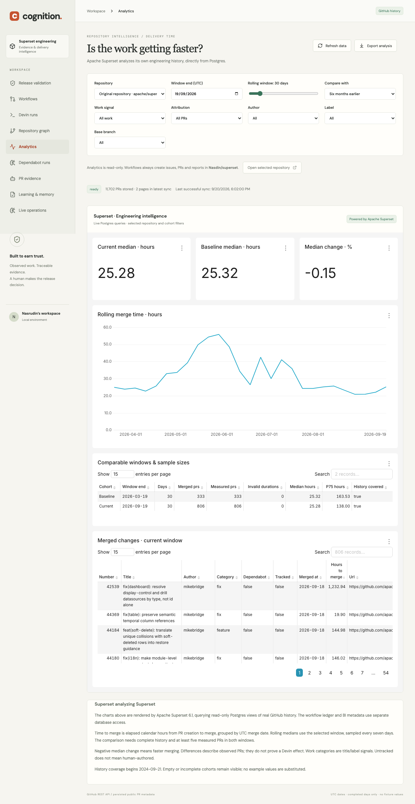
