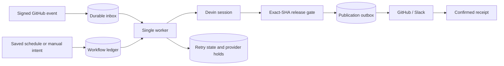

# Reliability and recovery

This runbook is for the engineer operating the demo. Use it to identify a failure, restore the failing dependency and resume the existing work without duplicating a paid Devin session, PR comment or Slack report.

The deployment deliberately uses one VM, one worker and one persistent database. It can retain work across process/container restarts and tolerate temporary provider outages. It has **no high availability, enabled backups or protection against loss of the VM's disk**. A Docker restart policy is not a disaster-recovery plan.

## What is durable



Postgres is the deployed store; SQLite supports local workflow use. Jobs, webhook intake, schedules, recovery attempts, provider holds, publication receipts, lessons and operator recovery intents persist in the database. Screenshots and other sanitized public evidence copies persist as immutable, content-addressed files in the shared data volume. Never delete the database or volume to clear an error.

The worker takes an operating-system file lock in the shared data volume. A second worker sharing that volume cannot run concurrently. This is a **single-host lock**, not distributed leader election: do not scale workers across different VMs or different data volumes. Compose restarts failed processes; it does not restore lost data or restart a container merely because its health status changes.

## Failure behavior

| Failure | System response | Operator action |
| --- | --- | --- |
| Temporary provider read failure or a request known to have been rejected | Persist the failure and retry with delay; exhausted attempts enter the dead-letter queue | Allow the next retry, or repair the cause and recover the same record |
| Provider rate limit | Honor the retry delay and open the provider circuit immediately | Wait for the reported time; avoid repeated manual probes |
| Repeated provider outage | Open that provider's circuit after three failures | Check provider status and let the later probe determine recovery |
| Expired credentials or exhausted credits | Hold affected work; authentication and credit holds require an operator probe after repair | Correct credentials or provider allocation, then **Check provider again** |
| Devin reports a recognized credit/quota suspension | Stop new paid writes; retain the existing session and visible hold | Resolve the provider limit, then use **Resume same session** when appropriate |
| App's total-session limit reached | Keep work blocked without creating an extra session | Review usage; increase the configured limit only within the authorized budget |
| Timeout after a paid session creation or report publication may have reached the provider | Preserve `unknown_effect`; do not automatically send again | Find and verify the existing session/report before reconciliation; no force-replay button exists |
| GitHub webhook arrives during a downstream outage | Persist a minimal signed, deduplicated inbox record before acknowledging it; process later | Inspect inbox/worker errors; periodic repository polling also recovers eligible missed activity |
| Worker or database connection fails | Keep durable records; restart/reconnect with backoff | Restore the dependency and inspect heartbeat and record state |
| GitHub/Slack report delivery fails after validation passed | Preserve validation; retry publication separately, using an existing receipt for confirmation | Recover the outbox record; do not rerun a paid validation just to repost evidence |
| Learning or analytics import fails | Expose the failure/freshness independently | Restore that integration; do not present stale charts or memory synchronization as current |
| VM or disk is lost | No automatic recovery guarantee | A separately retained and verified export would be required; backups are currently disabled |

Retries are bounded to **five failed attempts** per recovery cycle. The exponential delay starts at 30 seconds, adds up to 25% jitter and is capped at 1,800 seconds including jitter. A provider `Retry-After` can extend the wait up to 24 hours. Authentication/credit/circuit holds do not consume ordinary transient retry attempts. Operator recovery starts a new audited attempt cycle on the **same record**; it is not an unlimited automatic loop.

These controls do not promise exactly-once effects across the network. They prefer an explicit uncertain outcome over a duplicate external write. Readback can confirm a recorded receipt; it does not justify assuming an ambiguous write failed.

## Find the failure in the dashboard

1. Open **Workflows → Queue health & recovery**, or **Release gates → Evidence delivery & reliability**.
2. Read retrying, dead-letter, hold, unconfirmed and awaiting-delivery counts. Expand **Recovery & durability** for provider reasons, attempt history and next retry times.
3. Check the worker heartbeat. The page marks it overdue after three minutes. The container health probe fails after ten minutes without a database heartbeat. Neither indicator proves that every provider is healthy.
4. If the page cannot refresh, it labels the remaining values as stale and disables recovery controls. Restore API/database access before acting on them.

The shared reviewer password permits inspection. Expand **Execution access** with the private `OPERATOR_TOKEN` to recover work. This key is separate from the reviewer password and stays only in the current tab's memory for 15 minutes.

## Restore a provider and recover existing work

1. Inspect the actual failure. A larger app limit cannot refill credits, remove an organization cap or repair credentials. Check the configured Devin organization's usage/settings rather than guessing from an app error.
2. Correct credentials or limits in the private environment file when needed. Recreate the API and worker so they receive new settings; a simple container restart does not reload `.env`.
3. For a held provider, select **Check provider again**. This permits another probe; it is not a claim that the provider is healthy.
4. For a blocked/dead-letter job without a session, select **Retry safely** after repairing the cause. For an existing session, **Retry observation** returns to monitoring that same session. It does not create a replacement session or send a resume message.
5. A provider-suspended session may separately require **Resume same session** in **Workflows → Schedules & triggers**, after the provider limit is resolved. Keep its session ID and existing evidence history.
6. Verify the next heartbeat, provider readback and eventual job/evidence state. A recovery acknowledgment only means the request was recorded.

The deployed app limits are now **20 sessions across the ledger's lifetime and 20 ACU for each newly created session**. Fresh-install defaults remain 6 sessions and 10 ACU. Separately, Devin's default **Message usage** limit was changed from **$20 to $40**, and the existing dependency session's provider cap from **$10 to $20**. These provider dollar limits are independent of the application ACU/session limits; neither setting purchases credits. Other existing session budgets are not automatically increased. Pending work can consume available capacity when dispatch is enabled; never replace the ledger to reset the counter.

## Recover an evidence publication

An accepted release gate answers whether the exact candidate has sufficient validation evidence. The outbox answers whether a destination received the report. `review_ready` therefore does not mean `sent`, approved or merged.

After fixing a delivery failure, retry its existing publication record. If a provider receipt was already stored, recovery checks that receipt rather than sending another report. If the outcome is uncertain, inspect the destination and audit record first; the recovery endpoint rejects blind replay. Preserve earlier failed-gate comments as history. Do not start another Devin session simply because GitHub or Slack was unavailable.

The operator endpoints are:

| Endpoint | Body / purpose |
| --- | --- |
| `POST /api/live/recovery/inbox/{delivery_id}` | `{"request_id":"<UUID>"}`; recover blocked/dead-letter GitHub intake |
| `POST /api/live/recovery/jobs/{job_id}` | `{"request_id":"<UUID>"}`; recover an eligible existing job |
| `POST /api/live/recovery/publications` | `{"key":"<publication-key>","request_id":"<UUID>"}`; recover an eligible publication |
| `POST /api/live/recovery/providers/{provider}` | `{"request_id":"<UUID>"}`; permit a probe for `devin`, `github` or `slack` |

They require the operator Bearer token and `X-Cognition-Intent: session`. Reuse the **same UUID for the same request** after a network failure. Durable intent receipts prevent a repeated confirmation from becoming a fresh action. An HTTP 409 requires inspection/reconciliation; do not bypass it by editing database state.

## Stop new spending while retaining observation

Set `AUTOMATION_ENABLED=false` in the runtime configuration and recreate the API/worker. New paid sessions and scheduled dispatch stop. Observation of already-started sessions, evidence delivery, repository freshness checks and permitted background synchronization continue. This is not cancellation of an already-running Devin session and does not erase provider-side spend. Verify provider execution state separately when stopping all spending is necessary.

For a local Compose install:

```sh
docker compose up -d cognition worker
docker compose ps
docker compose logs --tail=100 cognition worker postgres
```

On the deployed VM use the existing `cognition-compose` wrapper so the production overlays and root-only configuration are retained. Do not run a second stack with an empty ledger. Keep secrets and raw environment dumps out of logs, PRs and incident screenshots.

## Recovery boundaries and next steps

Restart persistence requires the original database and data volume to remain intact. The current demo has no off-host backup, standby worker, multi-AZ database or external paging service. Public evidence files can be lost with the host, breaking historical image links. Disk pressure must be repaired before queue writes can resume.

Before using this architecture for unattended production, add and test off-host database backups and restore drills, move evidence to durable object storage, configure external alerting, and introduce a managed redundant database. Multiple workers would additionally require distributed claims/fencing and isolated execution; increasing the replica count alone is unsafe. These are future steps, not deployed capabilities.

## Verification

The automated suite is designed to exercise temporary provider failures, rate limits, exhausted retry attempts, restart persistence, stale heartbeat, ambiguous writes, receipt-only confirmation and owner-only recovery. Browser tests exercise stable request IDs and disabled replay for uncertain outcomes. Run the repository's backend and frontend checks before releasing changes; a passing fixture test does not prove a live provider outage was recovered.

For a controlled operational check, use an isolated database and fake providers to interrupt processing between intent, provider request and receipt recording. After restarting, verify the original job/session identity and absence of duplicate creates or publications. Do not manufacture provider failures against the live credit account to demonstrate resilience. Record real recovery evidence separately from test results and candidate-validation evidence.
