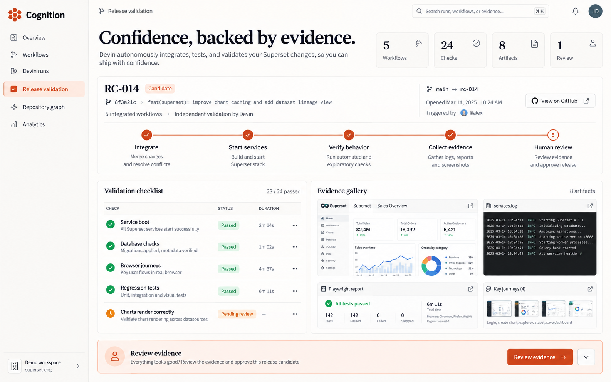
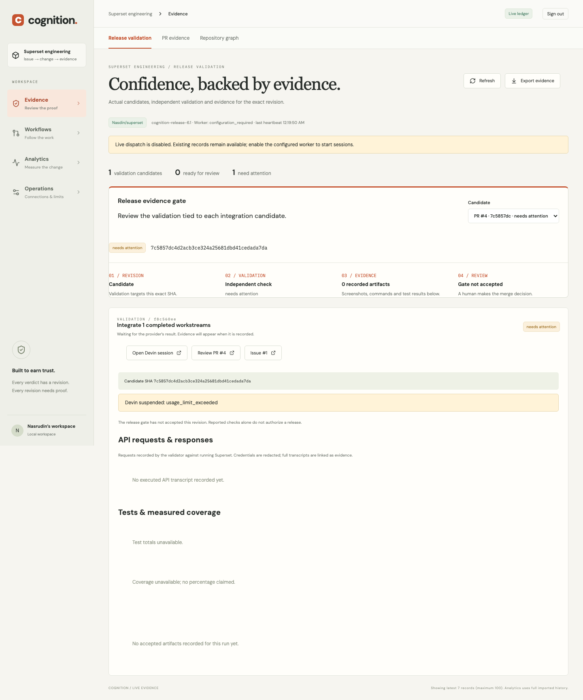
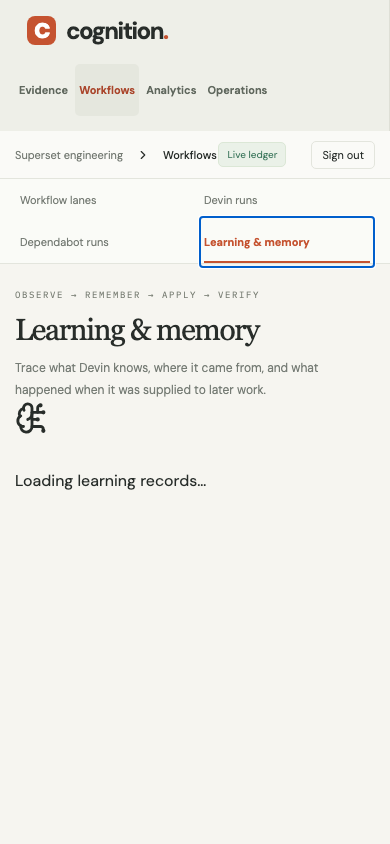
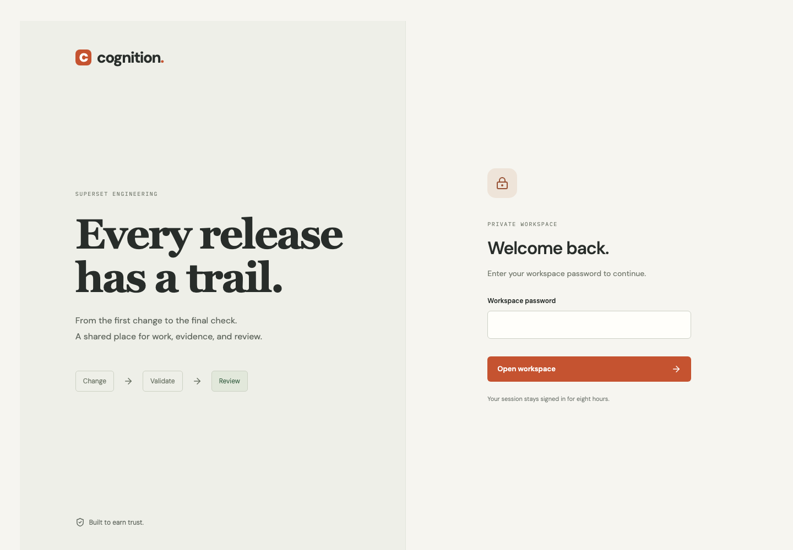
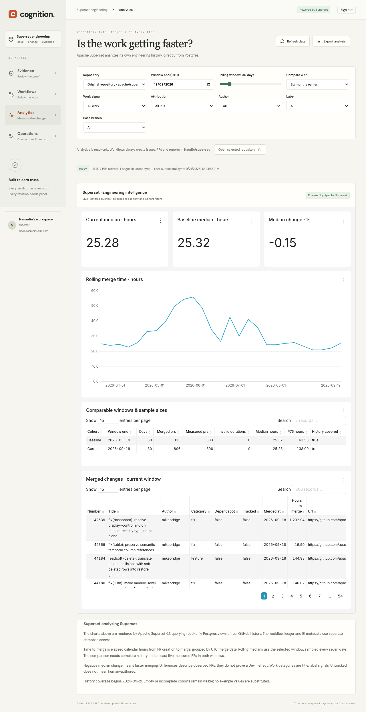

# A smaller navigation, the same capabilities

The referenced “Explain Challenge Updates” conversation centered on an independent validation agent proving an exact integrated revision. The original saved mockup uses a warm neutral palette, orange emphasis and an evidence-first candidate view. One generated mockup was found in this repository; the remaining visuals are implementation screenshots.

The implemented dashboard groups nine destinations into four workspaces:

| Workspace | Features inside it |
|---|---|
| Evidence | Release validation, PR evidence, repository graph |
| Workflows | Workflow lanes, Devin runs, Dependabot runs, learning and memory |
| Analytics | Embedded Superset analysis, upstream/fork selection, sliding windows |
| Operations | Provider configuration, worker status, limits, receipts |

The candidate view shows its exact SHA, independent validation state, recorded artifact count and review status. A missing or suspended validation never appears accepted. Feature views have bookmarkable links and keyboard navigation; the phone layout wraps feature choices into two columns.

## Deployed application, before DNS cutover

These screenshots show the real Sydney database through an authenticated SSH tunnel at revision `5367575`. They are not mock data and are not proof of public HTTPS. The existing validation is suspended for `usage_limit_exceeded`, which is intentionally visible. A subsequent spacing adjustment adds padding around the revision and proof stages.

## Public launch

The public HTTPS deployment at [superset-devin.nasrudinsalim.com](https://superset-devin.nasrudinsalim.com) passed login, navigation and Superset chart/filter acceptance. The following images were captured by those tests on the public domain at revision `dbe780e`.

