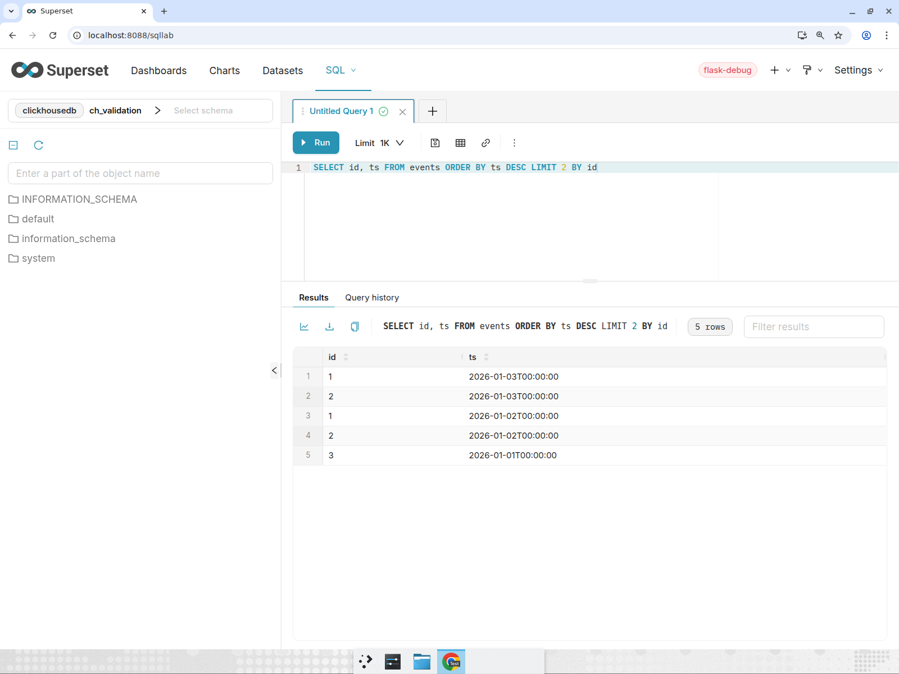
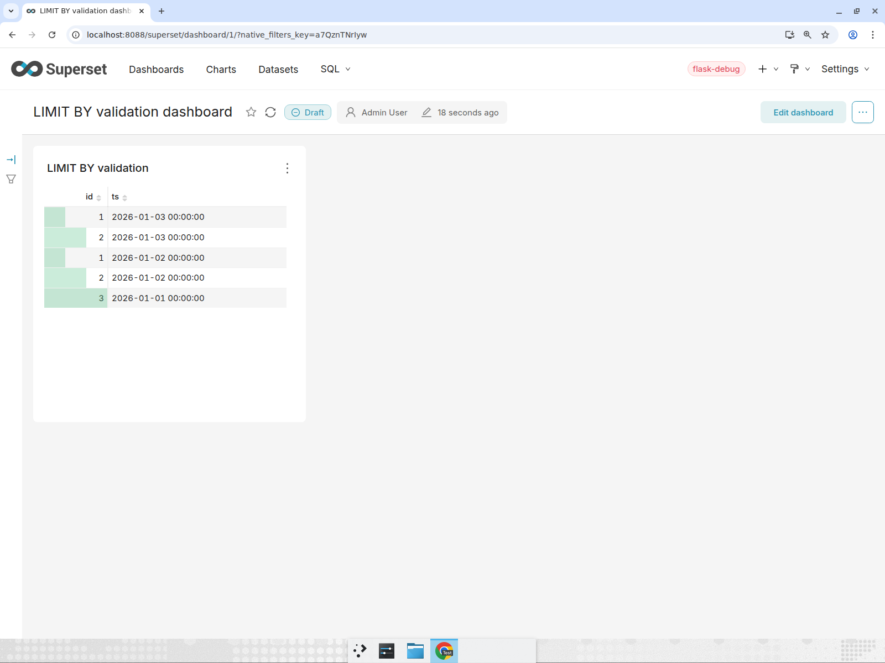

# ClickHouse LIMIT BY: independent Devin evidence

These are byte-for-byte copies of provider-owned artifacts archived by the local worker for Superset candidate `2e52222e6dcd4596972e37472a32915e4697c8b9`. Devin produced the runtime evidence. Codex inspected and copied selected files into this documentation directory; it did not recreate screenshots, edit transcripts, or author the Superset fix.

- [Execution history and limitations](../../LOCAL_AUTONOMOUS_RUN.md)
- [Provider links, hashes and GitHub publication receipts](readback.json)
- [Browser journey video](browser-journey.mp4)
- [API requests and responses](api-transcript.txt)
- [Test output](test-report.txt)
- [Scoped coverage](coverage.json)

The local worker uses Postgres. The separate candidate Superset validation used SQLite for its disposable metadata and ClickHouse for the actual behavior under test. This does not change the application's Postgres deployment architecture.

The JSON receipt is a point-in-time readback, not a continuously updated status endpoint. Consult the linked PR for current CI and merge state. The original public evidence URLs depend on the local temporary tunnel; the copies here remain reviewable from Git.

